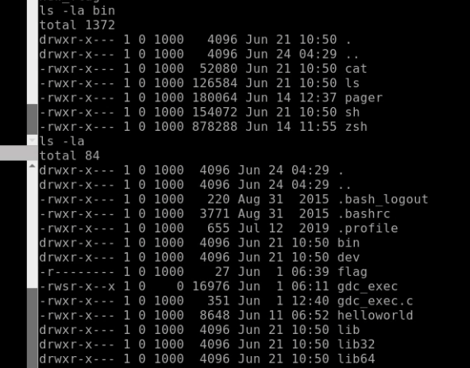
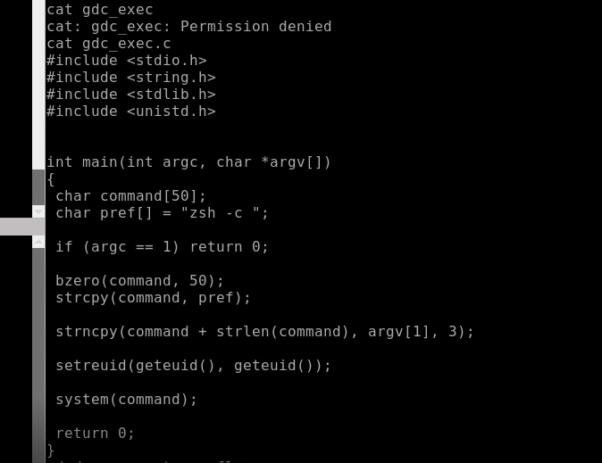

# Length Matters?

## CATEGORY

Binary Exploitation

## Challenge

You are provided with credentials to a GDC server. It has an executable file that might reveal some juicy info. Find a way to exploit it.

200 points

## Hint(s)

None used

## Solution

We first nc into the IP address to get a shell which contains some files. There are a limited number of commands we can run though.

We notice that we are able to execute gdc_exec, and it has full permissions. We are also able to read gdc_exec.c to see what is inside the function.

Based on the code, what gdc_exec does is that it allows us to execute `zsh -c (command)', where command is only 3 characters long, with full permissions.

We are able to abuse this to read the flag in flag.

## Flag

    CDDC21{0nly_thr33_ch@rs??}
