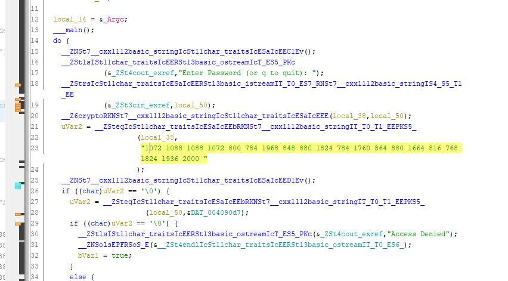

# Shifting

## CATEGORY

Reverse Engineering

## Challenge

The recently captured file server contained a mysterious file that was probably used for getting access to other resources. Can you find the correct password?

## Hint(s)

None used.

## Solution

We analyse the file with Ghidra to find this:

The highlighted line looks like it could possibly start with "CDDC", and we noticed that from C to D, the number increased by 16.

From here, we divided all the numbers by 16 and converted them from character codes to characters, which yielded us our first flag for Reverse Engineering.

## Flag

    CDDC21{57r1n67h30ry}
