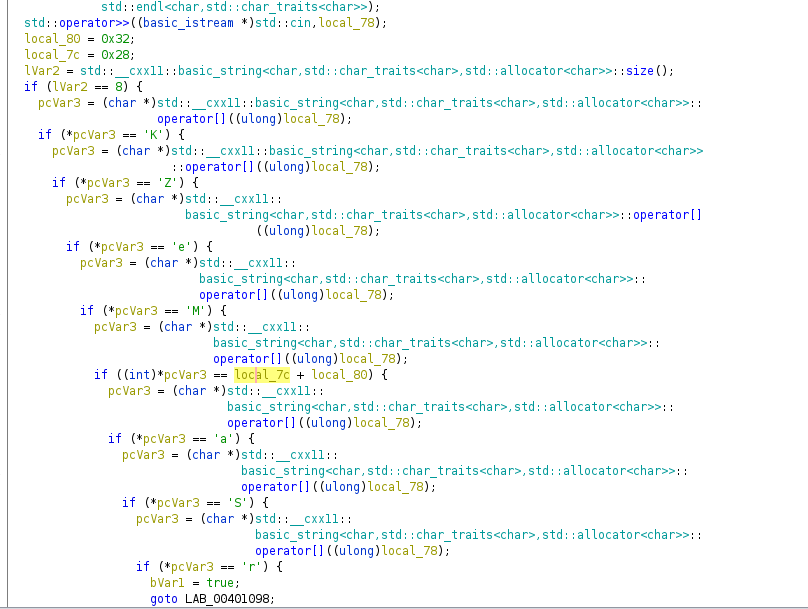
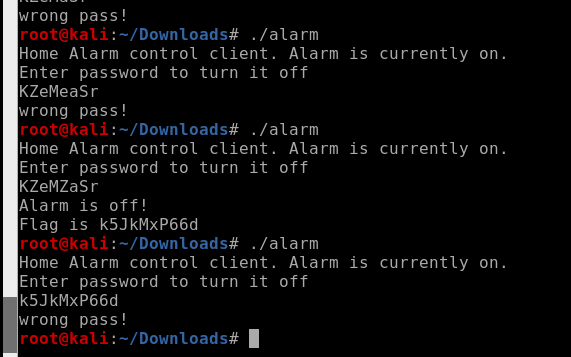

# Alarm

## CATEGORY

Reverse Engineering

## Challenge

We are planning to break into one of the laboratories of the GDC, but we need to find a way to disable their security alarm. The first stage will be to find the alarm code.

300 points

## Hint(s)

None used.

## Solution

We analyse the binary with ghidra to find this:

From here, it appears that what the code is trying to do is to compare each character in the input, with 9 if conditions.

We assemble our characters together to get: k5JkMxP66d

## Flag

    CDDC21{k5JkMxP66d}
