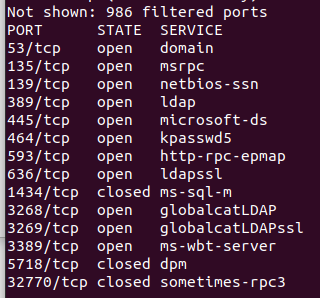

# Light

## CATEGORY

Windows

## Challenge

It's time to expose the GDC! We have successfully obtained the IP address of their AD server. First, try to list the different users that are configured on the server.

200 points

## Hint(s)

None used.

## Solution

Doing a normal nmap scan yields us this:

Looking at this, we try a few things and get to the point where we use nmap to search ldap

    map -Pn -p 389 --script ldap-search --script-args 'ldap.maxobjects="-1"' 18.136.74.102 | grep CDDC

Doing the following finds us the flag.

    | description: Vice President at Global Domination Corporation. CDDC21{GDC2!_1nte4NaL}

## Flag

    CDDC21{GDC2!_1nte4NaL}
