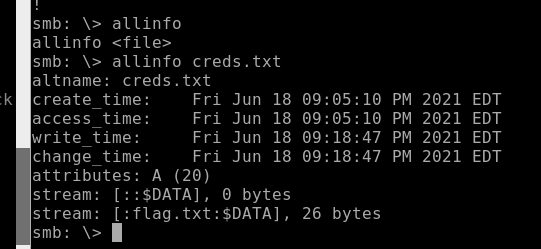

# Alternative Way

## CATEGORY

Windows

## Challenge

You're doing great! We're almost there, but we need to find a way to take control of this server. What about the backup folder?

## Hint(s)

None used

## Solution

We are able to login to samba again with John and his password #johnIStheBEST! to gain access to the backup folder.

Initially, it was quite confusing as the size of the file was 0 bytes, and the file was empty.

However, we found out that there was a possibility of ADS (Alternate Data Streams), which is specific to Windows and NTFS.

Running allinfo shows us this, which means the flag is on another data stream. However, when we get the flag from the share, the alternate data stream goes missing.

    get "creds.txt:flag.txt:$DATA" allows us to get the flag from the alternate data stream.

## Flag

    CDDC21{An0the4_STREAM!}
