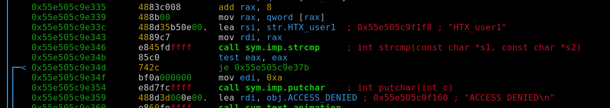
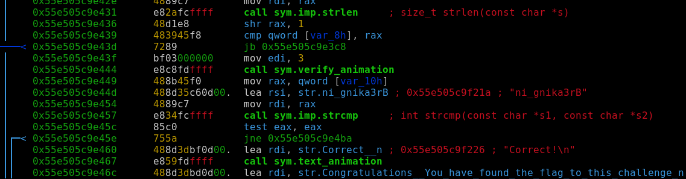
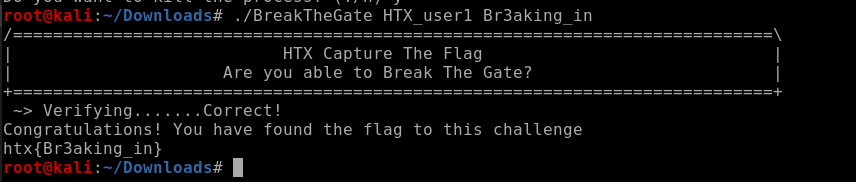

# A06 - Break the Gate

## CATEGORY

Reverse Engineering

## Challenge

An unknown executable file was found on the web server that hosts the defaced website.

A username and password is required to access the sensitive information inside this executable file. Discover the username and password needed to unlock this file.

The flag will appear in the following format: htx{String}.

## Hint(s)

None used.

## Solution

We run the file in radare2 with the command `r2 -d BreakTheGate`, and use `aa` and `pdf@main` to inspect the file.

We get the username:

and a reversed form of the password:

and we can enter this with the binary to get the flag.

## Flag

htx{Br3aking_in}
