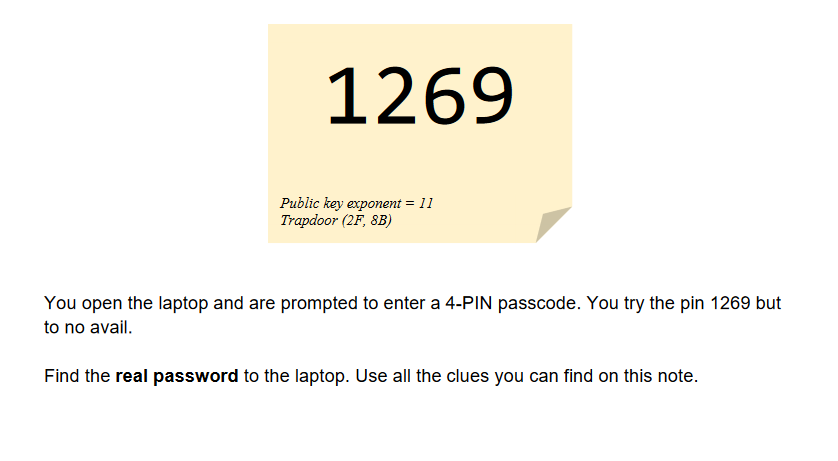

# C61 - Prime Password

## CATEGORY

Crypto

## Challenge

Laptop, cables, mouse and a note were found on the table at the hideout. On the note, 4 numbers were written but it cannot be used to unlock the laptop. You are required to further investigate the information provided to unlock the laptop.

This is the 1st challenge in a series of 6 sequentially linked challenges. Once you have submitted the correct flag for a challenge in this series, the next challenge in the series will be unlocked.

The flag and solution is a number.

## Hint(s)

None used.

## Solution



Read up on RSA algorithm and solve by brute forcing private key. 
Trapdoor make references to asymmetric encryption. 2F, 8B are primes (47 and 139 in decimal). 11 is the public key and 1269 should be the encrypted message. 

```
import math

p = 47
q = 139
n = p*q
m = (p-1)*(q-1)
A = 1269  # Encrypted
a = 0  # Original
private = []  # private e
priv = 0
public = 11  # d
while True:
    priv += 1
    if (priv*public)%m == 1 and math.gcd(priv, m) == 1:
        print(priv)
        private.append(priv)
    if priv > n:
        break

# Checking
for pp in private:
    a = (A**pp)%n
    print(a)
    print((a**public)%n)
    print((A**pp) % n)
```

Private key is 5771, original message is 2350. 


## Flag

2350
