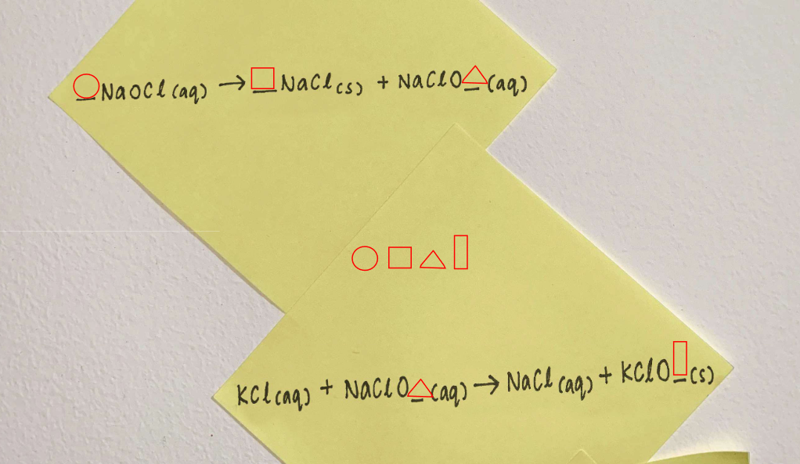

# C67 - Identify the bomb making lab 1

## CATEGORY

Chemistry

## Challenge

During the raid on the suspect house a lab was found inside the suspect unit, prelimary reports shows that this could be a bomb making lab. Hence, you are now being called upon to help identify the first mysterious compound that are used to make the super explosive deployed in the UAV attack.

At the lab, you find a locked safe with sticky notes on it. The sticky notes have chemical equations hastily scribbled on. It could be a hint to opening the safe, but the coefficients and subscripts have been replaced with symbols.

Download the attached scan of the sticky notes and balance the equations.

The flag is a 4 digit pin. You are only given 2 attempts for this challenge. Completing this challenge will unlock C68.

## Hint(s)

None used.

## Solution

Balancing the chemical equations and fitting into the shapes, we get the value 3233, which is the flag.

## Flag

3233
